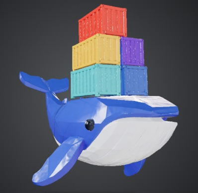

# 🐳 Moby Studio — Plataforma AR 3D & AI WebXR de Docker

<p align="center">
  
</p>

<p align="center">
  
  
  
  
  
  
</p>

¡Bienvenido a **Moby Studio**! Una suite de desarrollo y simulación en **Realidad Aumentada (AR) interactiva y visión local por Inteligencia Artificial**. Diseñada originalmente sobre tecnologías WebXR, esta plataforma permite a desarrolladores y entusiastas DevOps experimentar un ecosistema de modelado 3D procedural controlado por Blender, análisis de radar asistido por YOLOv8, integración didáctica con Ollama (Qwen) y un lienzo 3D interactivo premium de alto rendimiento.

---

## ✨ Características de Calidad Premium

### 🕹️ 1. Lienzo 3D y Gizmos de Transformación (Estilo Blender/Unity)
*   **Gizmos Interactivos Directos (Viewport Drag):** Sustituimos las líneas de coordenadas base por **3 flechas cilíndricas tridimensionales estilizadas con puntas cónicas** (Rojo: X, Verde: Y, Azul: Z) renderizadas sobre la geometría (`depthTest: false`) para que nunca queden ocultas.
*   **Arrastre Preciso (Three.js Math):** Al hacer clic y arrastrar un eje, se calcula la proyección 3D del arrastre en 2D según la orientación de la cámara (`camera.quaternion`) mapeando la sensibilidad proporcionalmente a la distancia cámara-objeto. Bloquea temporalmente los controles orbitales de cámara (`look-controls`) durante el arrastre.
*   **Barra de Herramientas Flotante:** Acceso rápido a herramientas de navegación, imán de snapping (pasos de 0.5 unidades / 15°), borrado rápido de entidades y un robusto historial de transformaciones con **Deshacer (Undo - `Ctrl+Z`) y Rehacer (Redo - `Ctrl+Y`)**.
*   **Estrella de Orientación del Viewport (Compass Widget):** Widget circular Glassmorphic en la esquina superior derecha que renderiza dinámicamente un canvas 2D con ordenamiento por profundidad de atrás hacia adelante (Depth Sorting) de las 6 orientaciones cartesianas. Ofrece **vista ortográfica rápida** (Top, Front, Side, etc.) con transiciones de suavizado (easing cubic-out).

### 📱 2. Refactorización Spatial UI/UX (index.html - Cliente WebXR)
*   **HUD Colapsable:** Botón interactivo chevron (`.btn-collapse`) que desliza mediante hardware GPU (`translateY`) el panel completo ocultando bloques pesados para liberar espacio de cámara física en celulares, dejando visible únicamente un micro-panel con el botón del micrófono.
*   **Máquina de Estados de Inferencia (AI):** Función reactiva `setInferenceState(state)` para fases de inferencia (`idle`, `capturing`, `yolo_vision`, `ollama_reasoning`, `speaking`). Integra pulsos glow en el micrófono y una cortina de luz láser holográfica móvil (`#scanner-laser`) que simula el análisis visual del entorno.
*   **Interfaces Flotantes (A-Frame Billboard):** Componente `billboard-ui` de A-Frame que reorienta dinámicamente planos en cada frame para que siempre miren al usuario. Permite click interactivo para **lanzar contenedores virtuales con rotación acrobática** directa a marcadores WebXR físicos.
*   **Iluminación PBR y Sombras Físicas:** Inyección de luces direccionales con proyección fidedigna de sombras (`castShadow: true`) y ambientales suaves para un sombreado realista sobre texturas físicas y metálicas.

### 📸 3. Sistema de Image Tracking y Disparadores Multimedia
*   **Menú Contextual 3D via Raycaster:** Al hacer click derecho (`contextmenu`) en el lienzo, proyectamos un `THREE.Raycaster` para ubicar el objeto raíz y desplegar un menú Glassmorphic flotante con opciones contextuales.
*   **Modal de Configuración de targets (`#ar-trigger-modal`):** Panel interactivo con selectores para configurar disparadores fidedignos asociando imágenes físicas a tres tipos de contenidos AR:
    *   `3d`: Modelos tridimensionales GLTF (`<a-entity gltf-model="...">`).
    *   `image`: Planos de imagen plana (`<a-image>`).
    *   `video`: Planos `<a-video>` alimentados dinámicamente por tags `<video>` HTML invisibles con restricciones móviles (`playsinline loop muted`).
*   **Autoplay Reactivo en WebAR:** Controladores automáticos que reproducen el video (`play()`) al detectar el marcador con la cámara (`targetFound`) y lo pausan instantáneamente (`pause()`) al perder el marcador de vista (`targetLost`).
*   **Simulador de Escritorio (Desktop debug):** Permite hacer click en computadoras sobre el marcador flotante para simular la detección del target en pantalla y depurar la reproducción rápidamente sin dispositivos móviles.

### 🎯 4. Sistema Dinámico Ilimitado de Marcadores AR y Targets Personalizados
*   **Creación e Instanciación Dinámica:** Sustituimos el sistema antiguo de 3 marcadores fijos (`marcador_a`, `marcador_b`, `marcador_c`) por una arquitectura de **Marcadores AR ilimitados** creados por el desarrollador. Se añade una tarjeta interactiva en el menú de assets para instanciar y posicionar marcadores planos directamente en la mesa 3D.
*   **Target Uploader Integrado:** Al hacer clic derecho o usar el inspector, abre un modal Glassmorphic para subir archivos de targets personalizados (imágenes físicas o códigos QR) a través de la API `/api/upload-media`, actualizando la textura del plano 3D en el editor al instante.
*   **Asociación Dinámica de Anclajes (Inspector):** Al seleccionar un objeto 3D, el inspector barre todos los marcadores creados en la escena para repoblar dinámicamente el desplegable **"Anclaje Físico AR (Target)"**, permitiendo asociar cualquier objeto a cualquier marcador de forma 100% interactiva.
*   **Reproducción Dinámica en index.html:** El cliente WebXR lee el archivo `layout.json` y genera de forma dinámica canales y contenedores de rastreo A-Frame para cada marcador personalizado, agrupando físicamente a las entidades hijas en la posición exacta del target. 
*   **Compatibilidad Retrospectiva y Simulador de Canales:** Auto-mapea e instancia virtualmente marcadores equivalentes para diseños antiguos que referencian los identificadores fijos. En ordenadores de escritorio, permite cliquear sobre las interfaces espaciales flotantes de cada marcador para simular el reconocimiento físico de cámara (`targetFound`/`targetLost`) y testear la reproducción de video y animación de contenedores en tiempo real.

---

## 📂 Arquitectura Organizada del Repositorio

El proyecto ha sido saneado y organizado en carpetas estructuradas de acuerdo a sus responsabilidades:

```text
mcpBlender/ (Raíz del Repositorio)
├── medios/                 # Recursos multimedia e imágenes de documentación del proyecto
│   ├── image.png           # Captura principal de pantalla
│   └── WhatsApp Image...   # Captura complementaria
├── moby_studio/            # Carpeta Core de la Aplicación
│   ├── _archive/           # Backups históricos de código (server.py anterior y JS redundantes)
│   ├── output/             # Directorio activo de guardado (layout.json y modelos GLB/multimedia)
│   ├── scripts/            # Scripts generadores procedurales de Blender
│   │   ├── gen_ballena.py
│   │   ├── gen_buque.py
│   │   ├── gen_laptop.py
│   │   ├── gen_server.py
│   │   ├── generar_contenedor.py
│   │   └── compress_model.py
│   ├── vision/             # Modelos y pesos de Inteligencia Artificial (YOLO)
│   │   ├── yolov8_docker_custom.pt
│   │   └── yolov8n.pt
│   ├── venv/               # Entorno Virtual Python con dependencias locales
│   ├── editor.html         # Lienzo e interfaz premium de edición 3D (Gizmos, menus, modal)
│   ├── index.html          # Vista de presentación y Realidad Aumentada (Play AR, Image tracking)
│   └── lanzador_ar.py      # Servidor HTTP unificado y Backend API REST (Soporte upload-media)
├── .gitignore              # Reglas de exclusión para no subir venv/ ni pesos pesados .pt
└── README.md               # El documento que estás leyendo
```

---

## 🛠️ Guía de Inicio Rápido (Desarrollo Local)

### 1. Requisitos Previos
*   **Python 3.10+** (Instalado y en el PATH).
*   **Blender 4.2+** (Detectado automáticamente en Windows en archivos de programa o a través del PATH).
*   **Ollama** con el modelo `qwen` activo:
    ```bash
    ollama run qwen
    ```

### 2. Levantar el Servidor de Moby Studio
Navega a la carpeta del servicio central e inicia el backend en tu terminal:

```bash
cd moby_studio
python lanzador_ar.py
```

El servidor detectará dinámicamente tu dirección IP de red local (Wi-Fi) y realizará las siguientes tareas automáticamente:
1.  Generará un **Código QR único** (`qr_presentacion.png`) apuntando a tu servidor local.
2.  Iniciará el servidor HTTP con soporte para tipos MIME 3D en el puerto `8000`.
3.  Imprimirá en la consola las direcciones locales y móviles de acceso.

> **💡 Consejo Pro (Acceso Móvil HTTPS):** Para habilitar la cámara en tu celular, los navegadores exigen el protocolo HTTPS. Te recomendamos mapear el puerto local exponiéndolo mediante una herramienta segura como **Ngrok** o **Cloudflare Tunnel**:
> ```bash
> ngrok http 8000
> ```

---

## 🔌 Documentación de la API REST del Servidor

El backend de `lanzador_ar.py` expone los siguientes endpoints REST listos para interactuar con cualquier cliente:

| Endpoint | Método | Entrada | Salida | Descripción |
|---|---|---|---|---|
| `/api/list-models` | `GET` | Ninguna | `JSON Array` | Lista todos los modelos `.glb` en `output/` con tamaño real en disco y fecha de edición. |
| `/api/save-layout` | `POST` | `JSON Object` | `JSON Status` | Guarda la escena 3D actual (nombres, posiciones, rotaciones, escalas, disparadores) en `output/layout.json`. |
| `/api/upload-model` | `POST` | `Binary glb` | `JSON Object` | Sube un archivo `.glb`/`.gltf` externo y lo registra en la mediateca. |
| `/api/upload-media` | `POST` | `Binary file` | `JSON Object` | Carga genérica de archivos multimedia (MP4, PNG, JPG) y los almacena de forma segura en `output/` para targets. |
| `/api/delete-model` | `POST` | Query `?name=file.glb` | `JSON Status` | Elimina permanentemente el modelo físico de la carpeta `output/` del servidor. |
| `/api/generate-model`| `POST` | Query `?script=name.py`| `JSON Object` | Ejecuta a Blender en modo silencioso (`headless`) para compilar un modelo procedural. |
| `/api/compress-model`| `POST` | Ninguna | `JSON Status` | Comprime el modelo base actual mediante Blender usando el compresor Draco. |
| `/api/vision` | `POST` | `JSON {image: base64}` | `JSON {response: str}` | Realiza inferencia local YOLOv8 del frame de la cámara y genera analogía Docker vía Ollama. |

---

## 🐳 Créditos y Comunidad
Plataforma desarrollada con amor para fusionar la diversión de los videojuegos interactivos 3D con el aprendizaje práctico del ecosistema de contenedores. ¡Dockerizar el mundo nunca fue tan visual y sorprendente! 🚀⚓
