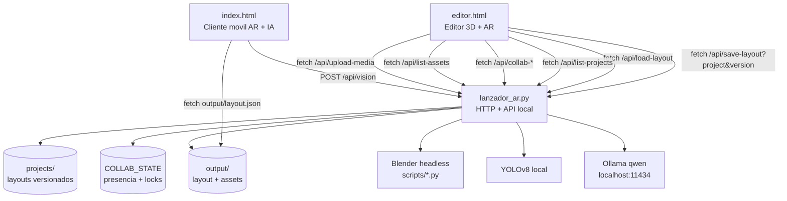

# Moby Studio - Arquitectura

Este documento describe la arquitectura actual de Moby Studio segun el codigo activo en `moby_studio/`.

## 1. Componentes



## 2. Frontend

### `editor.html`

Es la herramienta de autoria. El JavaScript activo esta embebido en el propio HTML.

Responsabilidades:

- Presentar una interfaz premium de estilo glassmorphic visionOS con combo boxes customizados, glows reactivos y transiciones fluidas.
- Renderizar e inyectar dinámicamente iconos vectoriales SVG (`stroke="currentColor"`) en jerarquías, outliner, validaciones e inspectores, garantizando nitidez e independencia de emojis.
- Mostrar una mediateca profesional con un diseño de tarjetas en dos filas (Thumbnail/Metadatos arriba y Badges/Botones abajo) para evitar la compresión en paneles estrechos, libre de scrollbars grises gracias a la utilidad `.no-scrollbar`.
- Mantener el estado local en `escenaObjetos`.
- Renderizar entidades A-Frame dentro de `#entities-container`.
- Editar transformaciones, nombres, anclajes y configuracion AR.
- Guardar el layout con `/api/save-layout`.
- Leer proyectos con `/api/load-layout?project=...`.
- Listar proyectos con `/api/list-projects`.
- Mantener presencia y locks con `/api/collab-heartbeat`.
- Administrar autosave local en `localStorage`.
- Administrar Undo/Redo por snapshots completos.
- Mostrar outliner, validador de publicacion y mediateca.
- Detectar versiones remotas y recargar cuando no hay cambios locales.

Estado principal:

```javascript
let escenaObjetos = [];
let entidadSeleccionada = null;
let contadorIds = 0;
let stageSize = { width: 3.0, height: 3.0, gridVisible: true };
let proyectoActivo = "default";
let proyectoVersion = 0;
let usuarioColaboracion = null;
let collabState = { users: [], locks: {} };
```

Subsistemas del editor:

- **Creacion AR rapida**: crea marcador + contenido y abre el flujo de configuracion.
- **Modal de disparador AR**: configura target fisico, QR/MindAR y contenido proyectado desde archivo local o URL directa.
- **Nodos OIRA**: contenido generado (`mediaType: "oira-node"`) sin depender de modelos GLB heredados.
- **Outliner**: lista targets, objetos anclados y objetos de mesa base.
- **Colaboracion**: muestra usuarios activos, bloquea objetos seleccionados por otros y avisa versiones remotas.
- **Validador de publicacion**: revisa targets, recursos, anclajes y guardado.
- **Mediateca**: lista assets de `output/`, filtra, sube, asigna y elimina.
- **Autosave**: guarda borradores en `localStorage`.
- **Undo/Redo**: guarda snapshots de `stage`, `entities`, seleccion y contador.

### `index.html`

Es el cliente final para telefono y pruebas AR.

Responsabilidades:

- Leer `output/layout.json`.
- Reconstruir la escena A-Frame final.
- Activar contenido por QR o MindAR.
- Mostrar contenido flotante para imagenes y videos.
- Mostrar nodos OIRA generados desde layout.
- Exponer controles compactos para telefono.
- Capturar frames de camara para `/api/vision`.

El cliente soporta:

- `BarcodeDetector` cuando el navegador lo ofrece.
- MindAR mediante CDN cuando un marcador tiene `trackingMode: "image"` y `mindTargetUrl`.
- Eventos de target encontrado/perdido para mostrar u ocultar contenido.

## 3. Backend

### `lanzador_ar.py`

Servidor local basado en `http.server.SimpleHTTPRequestHandler`.

Responsabilidades:

- Servir archivos estaticos.
- Guardar layouts.
- Guardar proyectos versionados.
- Mantener estado colaborativo en memoria.
- Subir y eliminar assets.
- Listar assets con metadata.
- Generar QR.
- Ejecutar scripts de Blender.
- Procesar vision local con YOLOv8 y Ollama.

Endpoints activos:

| Endpoint | Metodo | Responsabilidad |
|---|---:|---|
| `/api/save-layout?project=...&version=...` | POST | Guarda `projects/<project>/layout.json`, incrementa version y actualiza `output/layout.json`. |
| `/api/list-projects` | GET | Lista proyectos guardados con version y cantidad de entidades. |
| `/api/load-layout?project=...` | GET | Devuelve el layout versionado de un proyecto. |
| `/api/collab-heartbeat` | POST | Registra usuario activo, seleccion actual y lock temporal. |
| `/api/collab-release` | POST | Libera locks del usuario. |
| `/api/collab-state?project=...` | GET | Devuelve usuarios activos, locks y version remota. |
| `/api/list-assets` | GET | Lista assets con tipo, tamano, fecha, uso y proteccion. |
| `/api/delete-asset?name=...` | POST | Elimina assets no protegidos. |
| `/api/export-experience?name=...` | POST | Empaqueta visor, layout, assets usados y manifiesto en un ZIP. |
| `/api/list-models` | GET | Lista solo modelos para compatibilidad. |
| `/api/upload-media?name=...` | POST | Sube cualquier recurso multimedia. |
| `/api/upload-model?name=...` | POST | Sube modelos GLB/GLTF. |
| `/api/delete-model?name=...` | POST | Elimina modelos. |
| `/api/generate-qr?text=...&name=...` | POST | Genera QR en `output/`. |
| `/api/generate-model?script=...` | POST | Ejecuta Blender headless. |
| `/api/compress-model` | POST | Ejecuta compresion Draco con Blender. |
| `/api/vision` | POST | Procesa imagen base64 con YOLOv8 y Ollama. |

## 4. Persistencia

### `projects/<proyecto>/layout.json`

Archivo principal de autoria. Contiene proyecto, version, fecha de actualizacion, escenario y entidades.

```json
{
  "project": "default",
  "version": 2,
  "updatedAt": "2026-05-29 15:03:57",
  "stage": {
    "width": 3,
    "height": 3,
    "gridVisible": true
  },
  "entities": []
}
```

### `output/layout.json`

Archivo de compatibilidad y runtime. Se actualiza cada vez que se guarda un proyecto para que `index.html` y la exportacion sigan leyendo una ruta simple.

Cada entidad puede representar un target AR, modelo 3D, imagen o video.

Campos comunes:

- `uuid`
- `nombre`
- `posicion`
- `rotacion`
- `escala`
- `arAnchor`
- `hidden`
- `locked`

Campos de marcador:

- `isMarker: true`
- `markerImage`
- `recognitionKey`
- `trackingMode`
- `mindTargetUrl`
- `mindTargetIndex`

Campos de contenido:

- `modelId`
- `glbUrl`
- `mediaType`
- `mediaUrl`
- `relativeToAnchor`
- `oiraLabel`
- `oiraColor`
- `oiraNarration`

Valores principales de `mediaType`:

- `3d`
- `image`
- `video`
- `oira-node`

## 5. Mediateca

La mediateca se basa en `/api/list-assets`.

El backend clasifica extensiones:

- `.glb`, `.gltf` -> `model`
- `.png`, `.jpg`, `.jpeg`, `.webp`, `.gif` -> `image`
- `.mp4`, `.webm`, `.mov` -> `video`
- `.mind` -> `target`
- `.json` -> `data`

La respuesta incluye:

- `name`
- `friendlyName`
- `kind`
- `extension`
- `size`
- `sizeBytes`
- `src`
- `modelId`
- `date`
- `protected`
- `usedBy`
- `usedCount`

`layout.json` esta protegido. La deteccion de uso revisa rutas como `mediaUrl`, `markerImage`, `mindTargetUrl`, `glbUrl` y referencias por `modelId`.

## 6. Autosave

El autosave del editor usa:

- `moby_studio_editor_draft_v1_<proyecto>`
- `moby_studio_editor_last_published_v1`

Guarda un snapshot con:

- `stage`
- `entities`
- `savedAt`
- `version`
- `project`

Cuando el editor inicia, compara si hay un borrador local posterior al ultimo guardado y muestra un banner para restaurar o descartar.

## 7. Undo/Redo

El historial usa snapshots completos, no comandos parciales.

Cada snapshot guarda:

- `stage`
- `entities`
- `selectedUuid`
- `counter`
- `label`

Limite actual:

```javascript
const HISTORIAL_LIMITE = 50;
```

El sistema registra estado antes de operaciones mutantes y captura el estado actual al primer Undo si hay cambios no sincronizados. Esto permite Redo hacia el resultado real de la accion.

## 8. Colaboracion

La colaboracion actual es local/red LAN y usa estado en memoria del backend.

Estado backend:

```python
COLLAB_STATE = {
    "default": {
        "users": {},
        "locks": {}
    }
}
```

Reglas:

- Cada navegador crea un `userId`, nombre y color en `localStorage`.
- Cada 5 segundos envia `/api/collab-heartbeat`.
- Si el usuario tiene un objeto seleccionado, el servidor crea/renueva un lock temporal.
- Los locks expiran si no hay heartbeat en aproximadamente 18 segundos.
- El editor bloquea inputs, transformaciones, duplicar, ocultar y borrar cuando el lock pertenece a otro usuario.
- El heartbeat tambien devuelve `version`; si es mayor que la version local, el editor sincroniza automaticamente cuando no hay cambios locales.
- Si hay cambios locales sin guardar, se muestra aviso de version remota pendiente.

Limitacion actual: la sincronizacion es por version guardada, no por operacion atomica en tiempo real. Para edicion simultanea fina se requeriria WebSocket + operaciones/patches o CRDT.

## 9. Flujo AR

1. El usuario presiona una plantilla, por ejemplo `Marcador + Imagen`.
2. El editor crea un marcador y un contenido asociado.
3. El modal permite subir o generar el target fisico: QR, imagen/icono o `.mind`.
4. El modal permite subir archivo local o pegar URL directa del contenido.
5. El contenido guarda `arAnchor` con el UUID del marcador.
6. El layout se guarda en el proyecto y se copia a `output/layout.json`.
7. `index.html` carga `output/layout.json`.
8. El cliente activa contenido cuando detecta el QR o target MindAR.

## 10. Flujo De Assets

1. El usuario sube un recurso desde la mediateca o desde el modal AR.
2. El backend lo guarda en `output/`.
3. `/api/list-assets` lo lista con metadata.
4. El editor puede asignarlo al objeto seleccionado.
5. Si el asset esta referenciado en el layout guardado, aparece como "en uso".

## 11. Backlog

Las mejoras pendientes estan en `MEJORAS_PENDIENTES.md`.

Prioridades actuales:

1. Editor guiado de targets MindAR.
2. Inspector profesional de contenido AR.
3. Optimizacion de assets 3D.
4. QA movil.
5. Roles, comentarios y estados de revision.
6. Sincronizacion granular en vivo.
