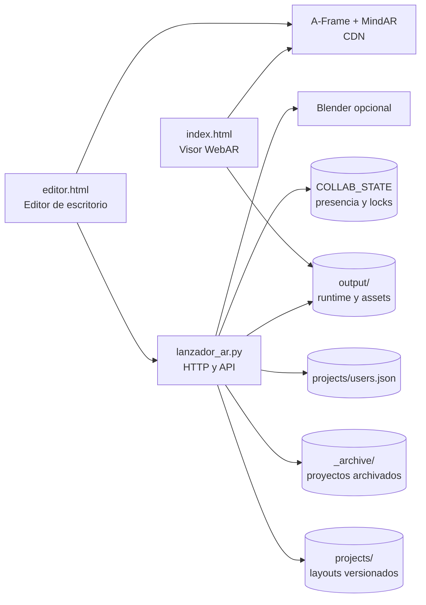

# Arquitectura de Moby Studio

Este documento describe el codigo activo en `moby_studio/`.

## 1. Vista general


```mermaid
flowchart LR
    Editor[editor.html\nEditor de escritorio]
    Viewer[index.html\nVisor WebAR]
    Server[lanzador_ar.py\nHTTP y API]
    Projects[(projects/\nlayouts versionados)]
    Output[(output/\nruntime y assets)]
    Archive[(_archive/\nproyectos archivados)]
    Users[(projects/users.json)]
    Collab[(COLLAB_STATE\npresencia y locks)]
    CDN[A-Frame + MindAR\nCDN]
    Blender[Blender opcional]

    Editor --> Server
    Viewer --> Output
    Editor --> CDN
    Viewer --> CDN
    Server --> Projects
    Server --> Output
    Server --> Archive
    Server --> Users
    Server --> Collab
    Server --> Blender
```

El backend sirve `moby_studio/` como raiz HTTP en el puerto `8000`. Es un `ThreadingMixIn` sobre `socketserver.TCPServer`, por lo que atiende solicitudes concurrentes sin un framework externo.

## 2. Editor

`editor.html` contiene HTML, CSS y JavaScript embebidos. A-Frame 1.4.2 se carga desde CDN.

Responsabilidades:

- mantener `escenaObjetos`, seleccion, contador y configuracion del escenario;
- renderizar targets y contenido dentro del lienzo A-Frame;
- editar transformaciones y relaciones `arAnchor`;
- crear plantillas de imagen, video, audio, modelo 3D y botones interactivos;
- administrar la mediateca;
- guardar y cargar proyectos versionados;
- mantener borradores, Undo/Redo, presencia y locks;
- validar la escena antes de publicarla;
- exportar proyectos editables y experiencias finales.

Estado principal simplificado:

```javascript
let escenaObjetos = [];
let entidadSeleccionada = null;
let contadorIds = 0;
let stageSize = {
  width: 3,
  height: 3,
  gridVisible: true,
  viewer: { chatEnabled: false }
};
let proyectoActivo = "default";
let proyectoVersion = 0;
```

`stage.viewer.chatEnabled` es un nombre de compatibilidad. En el visor actual controla el panel de narracion e instrucciones, no un servicio de IA ni un chatbot remoto.

### Subsistemas

- **Barra de actividad**: escena, creacion, recursos, validacion, publicacion, proyectos y ayuda. Es la fuente principal de navegacion; los subcontroles internos de seccion quedan ocultos.
- **Lienzo**: composicion visual, seleccion directa, transformaciones y preview movil.
- **Modos del lienzo**: Seleccionar (`V`), Orbita (`Q`), Mover (`W`), Rotar (`E`) y Escala (`R`).
- **Inspector**: propiedades exactas, anclaje, archivo y notas.
- **Modal AR**: configura target fisico, `.mind`, indice y contenido.
- **Outliner**: separa targets, contenido anclado y mesa base.
- **Mediateca**: carga, filtra, asigna, comprime y elimina assets.
- **Historial**: snapshots completos con limite de 50 estados.
- **Borradores**: snapshots por proyecto en `localStorage`.

## 3. Visor

`index.html` carga A-Frame 1.4.2 y MindAR 1.2.5 desde CDN. Lee `output/layout.json` y reconstruye la escena.

Flujo:

1. carga el layout publicado;
2. valida la configuracion de MindAR;
3. configura `imageTargetSrc` con el `.mind` comun;
4. crea un contenedor por target con su `mindTargetIndex`;
5. agrega el contenido a su contenedor segun `arAnchor`;
6. inicia camara y tracking tras la accion del usuario;
7. responde a `targetFound` y `targetLost`.

Tipos renderizados:

- `3d`: modelo GLB/GLTF o placeholder;
- `image`: panel de imagen;
- `video`: panel de video con control de reproduccion;
- `audio`: reproductor espacial con ondas animadas y sin controles internos de play/pause;
- `oira-node`: panel informativo heredado;
- `button`: boton tactil 2D o GLB con acciones de navegacion, visibilidad y control multimedia.

Los botones permanecen ocultos hasta el primer `targetFound` de su `arAnchor`; un boton sin target no se publica como control global. Si el target asociado no se ha detectado todavia, la interaccion no se habilita.

El raycaster se limita a `.clickable` e `.interactive-entity`. El visor incluye controles de escala/distancia, modo presentacion, narracion, ayuda y mensajes de estado.

Opciones de QA:

- `debugConsole=1`
- `debugMarkers=1`

## 4. Modelo de datos

El layout tiene esta forma general:

```json
{
  "project": "default",
  "version": 1,
  "updatedAt": "2026-06-19 12:00:00",
  "stage": {
    "width": 3,
    "height": 3,
    "gridVisible": true,
    "viewer": { "chatEnabled": false }
  },
  "entities": []
}
```

Campos comunes de entidad:

- `uuid`, `nombre`
- `posicion`, `rotacion`, `escala`
- `arAnchor`
- `anchorOffset`: posicion libre del contenido relativa al target fisico;
- `relativeToAnchor`
- `hidden`, `locked`

Campos de target:

- `isMarker: true`
- `markerImage`
- `recognitionKey`
- `trackingMode: "image"`
- `mindTargetUrl`
- `mindTargetIndex`

Campos de contenido:

- `mediaType`: `3d`, `image`, `video`, `audio`, `button` u `oira-node`
- `mediaUrl`
- `modelId`, `glbUrl`
- propiedades de panel, video o audio;
- `buttonLabel`, `buttonColor`, `buttonAppearance`, `buttonModelUrl` e `interaction { action, targetId }` para botones tactiles. Las acciones son `next`, `previous`, `show`, `hide`, `toggle`, `play`, `pause` y `stop`;
- `oiraLabel`, `oiraColor`, `oiraNarration` para compatibilidad.

## 5. Persistencia

### Proyecto editable

`projects/<proyecto>/layout.json` es la fuente de autoria versionada. Cada guardado valido incrementa `version`.

El backend devuelve `409` si `expectedVersion` no coincide con la version actual, evitando sobrescritura silenciosa.

### Runtime

`output/layout.json` se actualiza al guardar. Es la ruta estable leida por el visor y por la exportacion de experiencia.

### Borrador local

El navegador guarda borradores con una clave por proyecto. El borrador no sustituye al guardado del servidor y puede restaurarse o descartarse al recargar.

### Archivo

Los proyectos archivados se mueven a `_archive/`. El proyecto `default` no puede eliminarse.

## 6. Assets

Clasificacion de `ASSET_EXTENSIONS`:

| Extensiones | kind |
|---|---|
| `.glb`, `.gltf` | `model` |
| `.png`, `.jpg`, `.jpeg`, `.webp`, `.gif` | `image` |
| `.mp4`, `.webm`, `.mov` | `video` |
| `.mp3`, `.wav`, `.ogg`, `.m4a`, `.aac` | `audio` |
| `.mind` | `target` |
| `.json` | `data` |

`/api/list-assets` devuelve nombre, etiqueta amigable, tipo, extension, tamanos, ruta, fecha, proteccion y referencias de uso. La deteccion de uso revisa `mediaUrl`, `markerImage`, `mindTargetUrl`, `glbUrl` y `modelId`.

`layout.json` y otros archivos protegidos no se eliminan desde la mediateca.

## 7. Proyectos portables

El paquete editable usa:

```json
{
  "format": "moby-studio-project",
  "formatVersion": 1
}
```

Contenido:

```text
manifest.json
project/layout.json
assets/<assets locales usados>
LEEME.txt
```

La importacion limita el ZIP a 250 MB, 500 entradas y 600 MB descomprimidos. Valida formato, version, rutas declaradas y extensiones. Lee entradas concretas con `ZipFile.read`; no extrae rutas arbitrarias.

Si existe un asset con igual nombre y diferente contenido, crea otro nombre y reescribe referencias y `modelId` cuando corresponde. Un proyecto existente no se sobrescribe.

## 8. Colaboracion y cuentas

La colaboracion se mantiene en `COLLAB_STATE` y no persiste al reiniciar el servidor.

- heartbeat periodico por navegador;
- presencia y objeto seleccionado;
- locks con TTL aproximado de 18 segundos;
- aviso o recarga ante una version remota;
- liberacion al salir o cambiar seleccion.

No hay WebSocket, CRDT ni merge de operaciones. La unidad de sincronizacion es el layout guardado.

Las cuentas remotas se almacenan en `projects/users.json`. El acceso local detectado por `/api/connection-info` usa un administrador automatico para facilitar el desarrollo. Este sistema es adecuado para una herramienta local/LAN, no para exponer directamente el servidor a Internet sin una capa adicional de seguridad.

## 9. API

### Layout y proyectos

| Endpoint | Metodo |
|---|---:|
| `/api/save-layout?project=...&version=...` | POST |
| `/api/load-layout?project=...` | GET |
| `/api/list-projects` | GET |
| `/api/list-archived-projects` | GET |
| `/api/duplicate-project` | POST |
| `/api/rename-project` | POST |
| `/api/archive-project` | POST |
| `/api/restore-project` | POST |
| `/api/delete-project` | POST |
| `/api/export-project?project=...` | POST |
| `/api/import-project?name=...` | POST |

### Assets y publicacion

| Endpoint | Metodo |
|---|---:|
| `/api/list-assets` | GET |
| `/api/list-models` | GET |
| `/api/upload-media?name=...` | POST |
| `/api/upload-model?name=...` | POST |
| `/api/delete-asset?name=...` | POST |
| `/api/delete-model?name=...` | POST |
| `/api/compress-model` | POST |
| `/api/export-experience?name=...` | POST |

### Colaboracion y acceso

| Endpoint | Metodo |
|---|---:|
| `/api/collab-heartbeat` | POST |
| `/api/collab-release` | POST |
| `/api/collab-state?project=...` | GET |
| `/api/login` | POST |
| `/api/register` | POST |
| `/api/connection-info` | GET |

`/api/generate-model` esta retirado y devuelve un error de compatibilidad.

## 10. Dependencias y despliegue

Python usa modulos estandar: HTTP, sockets, JSON, ZIP, archivos y procesos. Blender es externo y opcional.

El frontend depende de CDN para A-Frame, MindAR y fuentes. En movil, `getUserMedia` exige un contexto seguro: HTTPS o `localhost`.

El servidor actual no implementa TLS, reverse proxy, sesiones firmadas, base de datos ni permisos de produccion. Para despliegue publico debe colocarse detras de infraestructura apropiada.

## 11. Verificacion

```powershell
python -m py_compile moby_studio\lanzador_ar.py
Invoke-WebRequest -UseBasicParsing http://localhost:8000/editor.html
Invoke-WebRequest -UseBasicParsing http://localhost:8000/index.html
git diff --check
```

El backlog vigente esta en [MEJORAS_PENDIENTES.md](MEJORAS_PENDIENTES.md).
